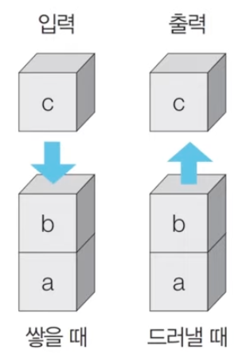
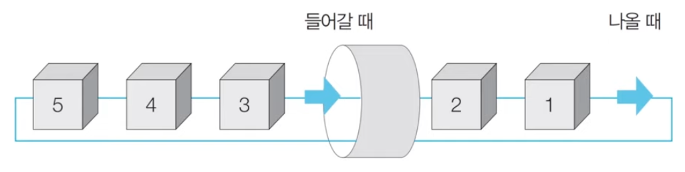

# Stack

* 먼저 들어 온 데이터가 나중에 나가는 형식(선입후출)의 자료구조
* 입구와 출구가 동일한 형태

* python의 list 자료형을 사용하면 list.append(), list.pop() 으로 구현 가능 
* print(list[::-1]) 참고

# Queue
* 먼저 들어 온 데이터가 먼저 나가는 형식(선입선출)의 자료구조
* 큐는 입구와 출구가 모두 뚫려 있는 터널과 같은 형태

* python의 collections.deque 라이브러리를 사용하면 deque.append, deque.popleft() 으로 구현 가능
* list로 특정 인덱스의 원소를 꺼내는 pop 으로 구현 할 수 있지만, 원소를 꺼낸 뒤 인덱스를 재배열 해야 하기 때문에 시간 복잡도가 더 높음.
